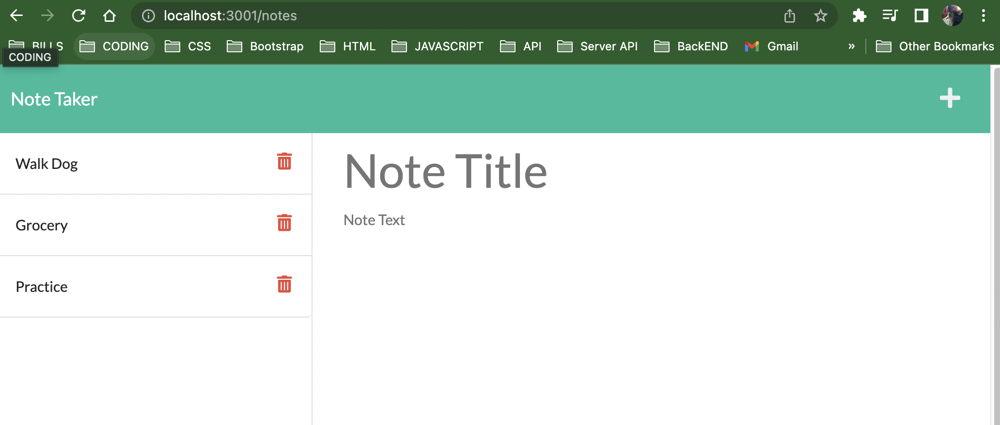
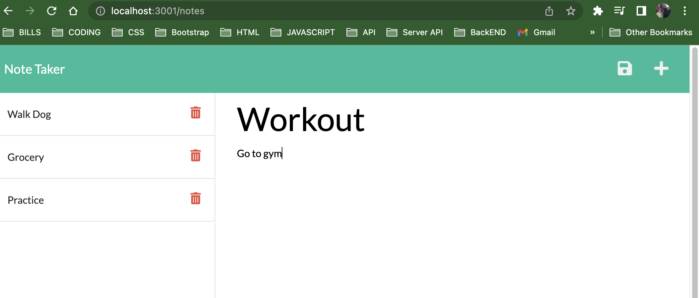
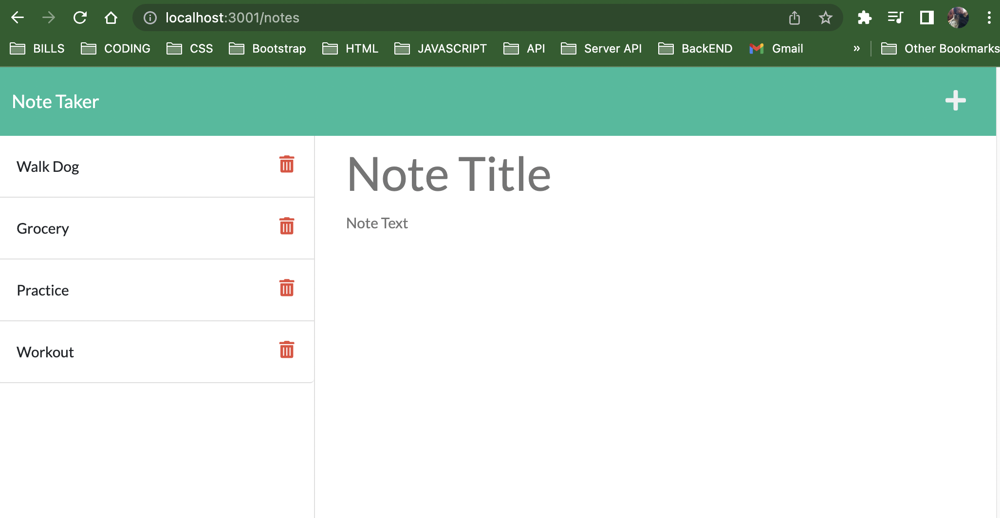

# homework-11-Express.js-Notetaker
Express.js Homework Challenge - Module Routing/Notetaker

Git Hub: https://github.com/minutemin/homework-11-Express.js-Notetaker

Heroku Link: https://hmwk11express.herokuapp.com/

## Badges

## Table of Contents (Optional)

If your README is long, add a table of contents to make it easy for users to find what they need.
- [Description](#description)
- [Installation](#installation)
- [Usage](#usage)
- [License](#license)

## Description

For this assignment, we were given a project that needed the back end built to connect to the database using Express.js with node.  We had to create a server.js file that directed to a routes index, which then leads to the notes pages that contains the get and post (delete) codes for the database.  This helps to keep complex code into a more organized way instead of everything in one file.  When databases get to be more complex, modular routing will make things much easier and organized. We learned about requiring express, and the paths and how to link the file to each other. 

## Installation

For this project, you will need to install npm.  

## Usage

To use this app, install npm and start it.  The console should say that it is now listening to port 3001.  In the page 3001, you should see the homepage with the "Get Started" button.  Click that and it should take you to the notes page.  You will see to the right and area to type in a note title and text to the left is a section where the notes will be listed.   When both title and text are filled, a save icon will appear in the top right corner of the window.  When you click save, the note should appear on the left side of the page in a list order.  For every new note created, it will be stored in that list to the left! If you want to delete a note, you can click on the trash icon and it will be deleted from the database. 

## License
Please refer to the link below if you need to read the terms and conditions of the license:
* [MIT license](https://choosealicense.com/licenses/mit/)
